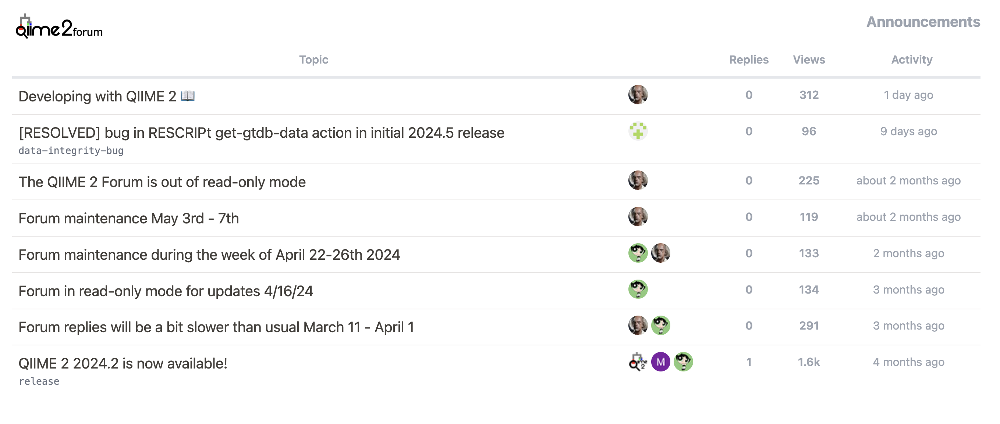

# Discourse topic listings for MyST Markdown websites

Add a Discourse topic listing to your website



## Setup and Usage

This package is published on `npm` and holds a MyST Markdown plugin for use on command line when building your website and a set of front end React components and functions that can be built into a custom theme.

To install the plugin in your MyST project:

1. Download the javascript module (`discourse.mjs`) from [https://unpkg.com/myst-ext-discourse@1.0.0/dist/discourse.mjs](https://unpkg.com/myst-ext-discourse@1.0.0/dist/discourse.mjs) and save this in your project folder
1. Add the module to the list of plugins in `myst.yml`:

```yaml
project:
  plugins:
    - discourse.mjs
```

The plugin will be loaded when you next run `myst start`

```sh
myst start

🔌 Discourse by Curvenote (discourse.mjs) loaded: 1 directive, 0 roles, 0 transforms
📖 Built example.md in 4.68 ms.
📚 Built 1 page for project in 30 ms.


        ✨✨✨  Starting Article Theme  ✨✨✨


🔌 Server started on port 3001!  🥳 🎉


        👉  http://localhost:3001  👈

```

Then add a `discourse` directives to your page.

```

:::{discourse} https://forum.myproject.org
:category: announcements
:mode: server
:limit: 8
:pinned: false
:logo: forum-logo.png
:logo-dark: forum-logo-dark.png
:logo-title: my forum logo!
:::
```

> [!TIP]
> MyST Markdown's plugin loading system is still developing, [look out for updates](https://mystmd.org/guide/plugins) on easier ways to access and load plugins.

### Directive Usage

<dl>
<dt>{arg}</dt>
<dd>URL of the discourse forum</dd>
<dt>category</dt>
<dd>(String) Name of the category to list topics from</dd>
<dt>mode</dt>
<dd>(String) The type of widget to display (default: `server`), (values: `widget`, `server`, `client`)/dd>
<dt>logo</dt>
<dd>(File) The forum logo</dd>
<dt>logo-dark</dt>
<dd>(File) Dark mode version of the forum logo</dd>
<dt>logo-title</dt>
<dd>(String) Title of the logo, used as alt text</dd>
<dt>limit</dt>
<dd>(Number) The maximum number of topics to show</dd>
<dt>pinned</dt>
<dd>(Boolean) Whether to show pinned topics</dd>
</dl>

### React Component Usage

Methods for installing a bundled renderer are still in development by the MyST Markdown project and Curvenote. In the meantime you can install this package from git (`git+https://github.com/<org>/<repo>.git#<branch>`) and include in your build.

## Developing

This repo builds the plugin and it's dependencies into a singel javascript module bundle using `tusp`.

1. clone this repo
1. `cd myst-ext-discourse`
1. `npm install`
1. `npm build`

## Contributing

Issues and PRs to extend this plugin are welcome!
